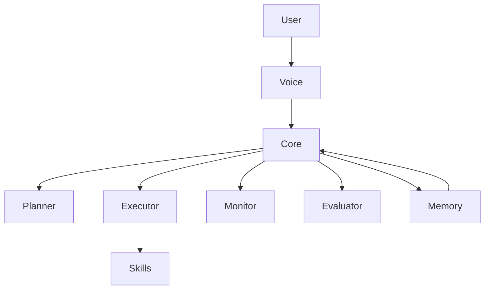

# 🤖 JARVIS — Autonomous Multi-Agent AI System


> A Stark-inspired AI system built for autonomy, control, and evolution.

---

## 🧠 Overview

JARVIS is a multi-agent autonomous AI system designed to:

- Execute complex tasks  
- Control your system  
- Learn and evolve by generating new capabilities  

This is not a chatbot — it’s a coordinated AI architecture.

---

## 🧩 Architecture



---

## ⚙️ Core Components

### 🔹 Entry Layer
- `main.py`  
  Initializes:
  - Voice system (Vosk)
  - Flask + SocketIO server
  - Autonomous core  

---

### 🧠 Autonomous Core
- `autonomous_core.py`
  - Coordinates all agents  
  - Handles full task lifecycle  

---

## 🤖 Multi-Agent System

| Agent     | Role                        |
|----------|-----------------------------|
| Planner  | Breaks tasks into steps     |
| Executor | Executes actions            |
| Monitor  | Tracks system & execution   |
| Evaluator| Validates outcomes          |

---

## 🧬 Self-Evolving System

- `coder_agent.py`
- `skill_synthesis_engine.py`

JARVIS can:
- Generate new Python skills  
- Test and integrate them  
- Expand its own functionality  

---

## 🧠 Memory System

- `semantic_memory.py` → Long-term knowledge  
- `conversation_log.json` → Context tracking  
- `topology_engine.py` → 3D knowledge graph  

---

## 👁️ Sensory Systems

### 🎤 Voice
- Vosk (offline speech recognition)  
- Edge-TTS (neural voice output)  

### 👀 Vision *(WIP)*
- `visual_observer.py`  
- `gesture_engine.py`  

---

## 🖥️ Interface

- **HUD (`index.html`)**
  - Real-time dashboard  
  - Chat + telemetry  

- **Holographic Lab (`lab.html`)**
  - 3D system visualization  

---

## 🛠️ Capabilities

### 💻 PC Control
- Mouse / keyboard control  
- App launching  
- Shell execution  

### 🌐 Communication
- WhatsApp messaging  
- Email sending  

### ⚙️ System
- Monitoring  
- Scheduling  
- File management  

### 🔍 Research
- Web search  
- Screen analysis  

---

## ⚡ Protocol System

```bash
"JARVIS, initiate house party protocol"
```

Triggers:
- Multi-agent coordination  
- Parallel execution  
- System-wide actions  

---

## 🚀 Installation

```bash
git clone https://github.com/rishaadj/JARVIS.git
cd JARVIS
pip install -r requirements.txt
python main.py
```

---

## 📊 Project Status

| Feature             | Status        |
|--------------------|--------------|
| Multi-Agent System | ✅ Complete   |
| Autonomous Core    | ✅ Complete   |
| Memory System      | ✅ Complete   |
| Neural Voice       | ✅ Complete   |
| Vision System      | 🚧 In Progress |

---

## 🔮 Roadmap

- [ ] Advanced reasoning (LLMs)  
- [ ] Full autonomy  
- [ ] Cross-device control  
- [ ] Real-time learning  
- [ ] Advanced UI  

---

## 🧠 Philosophy

JARVIS is built on:
- Modularity  
- Autonomy  
- Evolution  
- Control  

---

## ⚠️ Disclaimer

Educational and experimental project.  
Not affiliated with Marvel.

---

## 🧠 Final Note

> “Sometimes you gotta run before you can walk.” – Tony Stark
