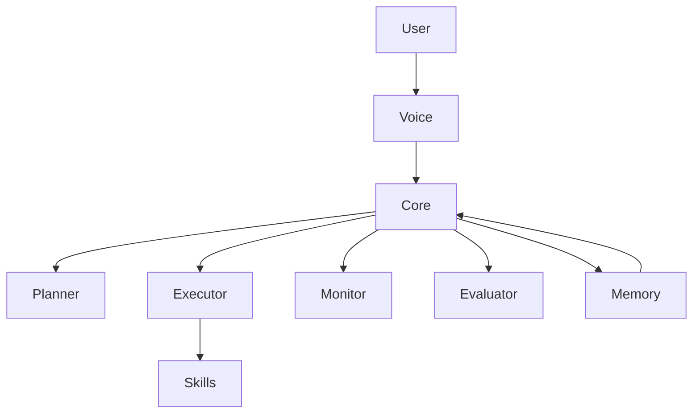

# 🤖 JARVIS — Autonomous Multi-Agent AI System


> A Stark-inspired AI system built for autonomy, control, and evolution.

---

## 🧠 Overview

JARVIS is a multi-agent autonomous AI system designed to:

- Execute complex tasks  
- Control your system  
- Learn and evolve by generating new capabilities  

This is not a chatbot — it’s a coordinated AI architecture.

---

## 🧩 Architecture



---

## ⚙️ Core Components

### 🔹 Entry Layer
- `main.py`  
  Initializes:
  - Voice system (Vosk)
  - Flask + SocketIO server
  - Autonomous core  

---

### 🧠 Autonomous Core
- `autonomous_core.py`
  - Coordinates all agents  
  - Handles full task lifecycle  

---

## 🤖 Multi-Agent System

| Agent     | Role                        |
|----------|-----------------------------|
| Planner  | Breaks tasks into steps     |
| Executor | Executes actions            |
| Monitor  | Tracks system & execution   |
| Evaluator| Validates outcomes          |

---

## 🛰️ Neural Switchboard (Multi-Provider)

JARVIS is now powered by a **Neural Switchboard** architecture that ensures 100% uptime with no costs:

1.  **Primary:** Google Gemini (2.5 Flash Lite) - Native Vision & 1.5M Context.
2.  **Fallback 1:** [Groq Cloud](https://console.groq.com/) - Blazing fast Llama 3.2 Vision (800+ tokens/sec).
3.  **Fallback 2:** [Ollama](https://ollama.com/) - 100% Offline privacy with Llama 3.2.
4.  **Final Resort (Unfiltered):** Ollama Dolphin - A completely uncensored reasoning model for unrestricted control.

If Gemini hits a 429 quota limit, JARVIS automatically fails over to Groq. If offline, he switches to Ollama.
 
> [!TIP]
> **Manual Override:** You can manually switch between these "Brains" via the Neural Bridge selector in the HUD sidebar. The Arc Reactor will change colors (Blue, Gold, Green, Pink) to show which brain is active.

---

## 🧬 Self-Evolving System

- `coder_agent.py`
- `skill_synthesis_engine.py`

JARVIS can:
- Generate new Python skills  
- Test and integrate them  
- Expand its own functionality  

---

## 🧠 Memory System

- `semantic_memory.py` → Long-term knowledge  
- `conversation_log.json` → Context tracking  
- `topology_engine.py` → 3D knowledge graph  

---

## 👁️ Sensory Systems

### 🎤 Voice
- Vosk (offline speech recognition)  
- Edge-TTS (neural voice output)  

### 👀 Vision *(WIP)*
- `visual_observer.py`  
- `gesture_engine.py`  

---

## 🖥️ Interface

- **HUD (`index.html`)**
  - Real-time dashboard  
  - Chat + telemetry  

- **Holographic Lab (`lab.html`)**
  - 3D system visualization  

---

## 🛠️ Capabilities

### 💻 PC Control
- Mouse / keyboard control  
- App launching  
- Shell execution  

### 🌐 Communication
- WhatsApp messaging  
- Email sending  

### ⚙️ System
- Monitoring  
- Scheduling  
- File management  

### 🔍 Research
- Web search  
- Screen analysis  

---

## ⚡ Protocol System

```bash
"JARVIS, initiate house party protocol"
```

Triggers:
- Multi-agent coordination  
- Parallel execution  
- System-wide actions  

---

## 🚀 Installation & Setup
 
Follow these steps to synchronize JARVIS with your system:
 
### 1. 📂 File Setup

```bash
git clone https://github.com/rishaadj/JARVIS.git
cd JARVIS
pip install -r requirements.txt

# --- MULTI-PROVIDER BRAIN ---
# 1. Get free Gemini keys at aistudio.google.com
# 2. Get free Groq API Keys at console.groq.com
# 3. Download Ollama at https://ollama.com/download
#    - Run: ollama pull llama3.2-vision
#    - Run: ollama pull dolphin-llama3

# Download the High-Accuracy Vosk Voice Recognition model (~1GB)
python setup_indian_vosk.py

python main.py
```
 
---
 
## 🔒 Privacy & Security
 
By default, JARVIS is configured to keep your data local and private. The following are **ignored** by version control (`.gitignore` to prevent leaking private data or large model files):
- `.env` (API keys)
- `.ollama/` (Local model weights)
- `screenshots/` (Visual context history)
- `memory.json` (Long-term semantic memory)
- `conversation_log.json` (Transcript history)
- `vosk-model-*/` (Large voice recognition models)

---

## 📊 Project Status

| Feature             | Status        |
|--------------------|--------------|
| Multi-Agent System | ✅ Complete   |
| Autonomous Core    | ✅ Complete   |
| Neural Switchboard | ✅ Complete   |
| Uncensored Mode    | ✅ Complete   |
| Vision System      | ✅ Complete   |
| Gesture Mastery    | 🚧 In Progress |

---

## 🔮 Roadmap

- [ ] Advanced reasoning (LLMs)  
- [ ] Full autonomy  
- [ ] Cross-device control  
- [ ] Real-time learning  
- [ ] Advanced UI  

---

## 🧠 Philosophy

JARVIS is built on:
- Modularity  
- Autonomy  
- Evolution  
- Control  

---

## ⚠️ Disclaimer

Educational and experimental project.  
Not affiliated with Marvel.

---

## 🧠 Final Note

> “Sometimes you gotta run before you can walk.” – Tony Stark
